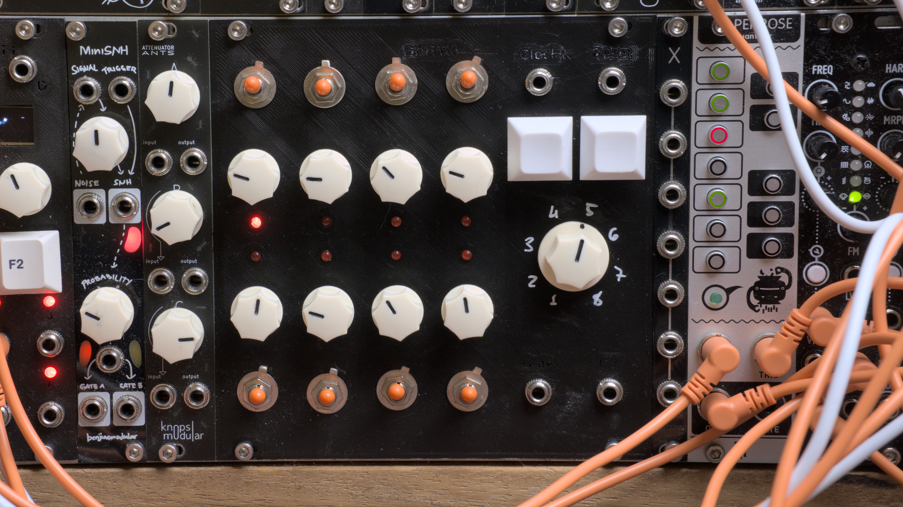
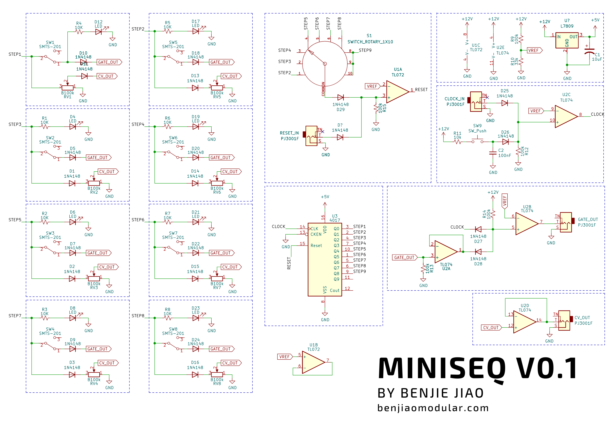

# MiniSeq
[![CC BY-SA 4.0][cc-by-sa-shield]][cc-by-sa]

Full docs on my website: https://benjiaomodular.com/post/miniseq/

This is my second time building a Baby-8 step CV sequencer since my [plexiglass Baby-8 build](https://benjiaomodular.com/post/2021-04-09-8-step-sequencer) from two years ago. This, time I added a gate output, a reset input, and a step length control.

 

## Schematics

 

## License

This work is licensed under a
[Creative Commons Attribution-ShareAlike 4.0 International License][cc-by-sa].

[![CC BY-SA 4.0][cc-by-sa-image]][cc-by-sa]

[cc-by-sa]: http://creativecommons.org/licenses/by-sa/4.0/
[cc-by-sa-image]: https://licensebuttons.net/l/by-sa/4.0/88x31.png
[cc-by-sa-shield]: https://img.shields.io/badge/License-CC%20BY--SA%204.0-lightgrey.svg
